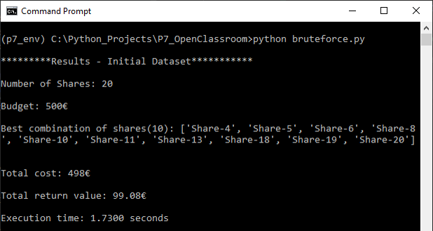
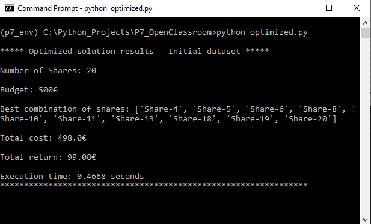

# Solve Problems Using Algorithms in Python

**OpenClassrooms - Python Developer Path:** Project 7

**Student:** Abdoul Baki Seydou

**Date:** 04/04/2023 

## Table of Contents
1. [Summary](#summary)
2. [Constraints](#constraints)
3. [Technologies Used](#technologies-used)
4. [Project Tasks](#project-tasks)
5. [Local Development](#local-development)
   - [Prerequisites](#prerequisites)
   - [Setup on macOS/Linux](#setup-on-macoslinux)
   - [Setup on Windows](#setup-on-windows)
   - [Running the Application](#running-the-application)
   - [Linting](#linting)
   - [Screenshots](#screenshots)

## Summary
This project consists of designing a memory-efficient algorithm for **AlgoInvest&Trade**.
The goal is to process share data from a file and suggest a list of the most profitable 
shares to invest in while adhering to predefined constraints.

This problem tackled here is a variation of the **01 Knapsack Problem**.

## Constraints
The algorithm operates under the following constraints:
- Each share can only be bought once.
- A fraction of a share cannot be bought.
- Maximum amount to spend is: 500 euros.

## Technologies Used
- **Programming Languages:** Python
- **Libraries:** Csv, itertools, time.
- **Data Source:** Share data stored in text files.

## Project Tasks
The resolution of the problem is split into three parts:

- **Part1: A Bruteforce solution:** For a list of 20 shares, a brute-force solution is implemented to evaluate
all possible combinations. It identifies the most profitable within the budget constraints.

- **Part2: An Optimized solution for a list of 20 shares:** An optimized version of the brute-force is developed 
   to achieve the same results under one second.

- **Part3: An Optimized solution for 1000 shares** The optimized algorithm is tested on a dataset of 1000 shares 
    to validate its performance and efficiency.

## Local Development

### Prerequisites
- Python 3.6 or higher.

### Setup on macOS/Linux

1. **Clone the Repository**
   ```bash
   cd /path/to/put/project/in
   git clone https://github.com/Afudu/P7_OpenClassroom.git

2. **Move to the folder**
   ```bash
   cd P7_OpenClassroom

3. **Set Up Virtual Environment**
   ```bash
   python -m venv venv
   
4. **Activate Environment**
   ```bash
   source venv/bin/activate 
   
5. **Securely upgrade pip**
   ```bash
   python -m pip install --upgrade pip 

6. **Install dependencies**
   ```bash
   pip install -r requirements.txt
   
7. **To deactivate Environment**
   ```bash
   deactivate

### Setup on Windows

1. Follow the steps above.

2. To activate the environment:
   ```bash
   venv\Scripts\Activate

### Running the application

* The repository contains two scripts:

    **1 -** bruteforce.py : Executes the bruteforce solution for a list of 20 shares.

    **2 -** optimized.py : Executes the optimized solution for a list of 20 shares, and a list of 1000 shares.

* To run each script:
   ```bash
   python script_file_name.py
  
* Data is read from the ```data``` directory.

### Linting
The codebase is fully linted and free of errors.

- To Run Linting:
  ````bash
  flake8

### Screenshots





